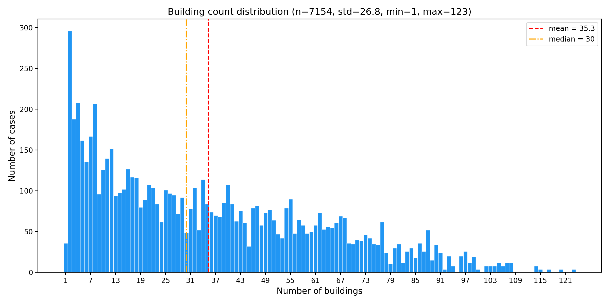
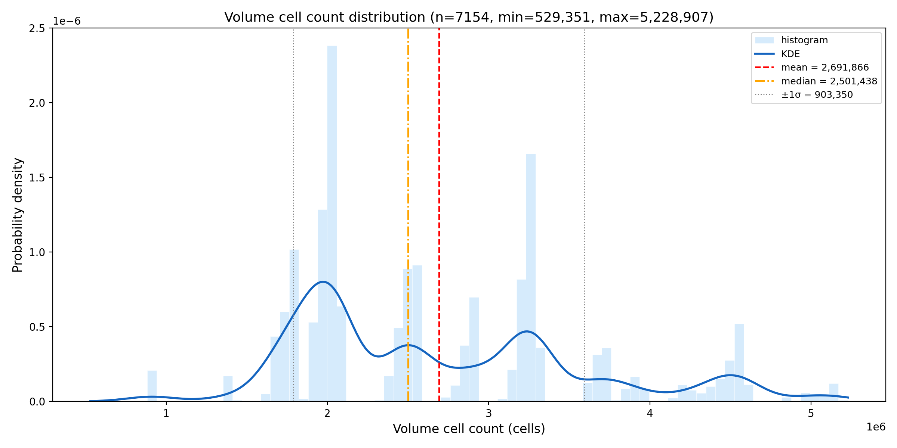
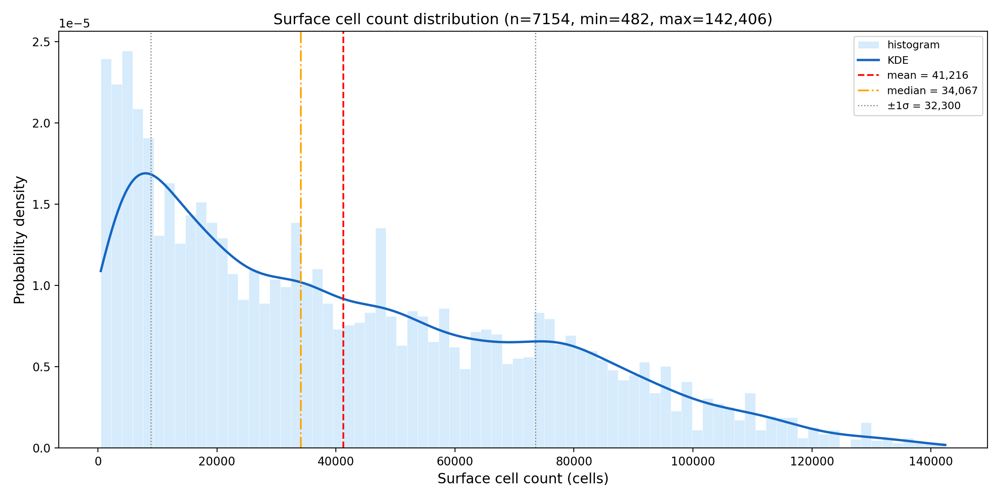
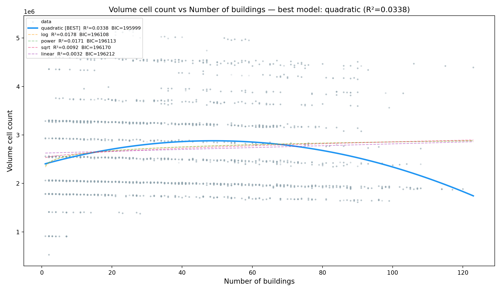
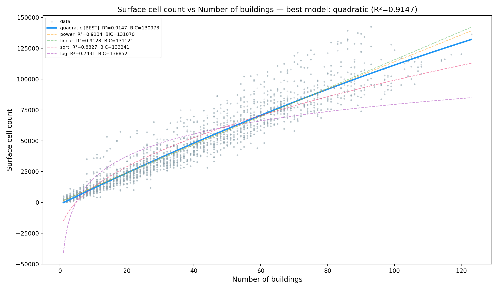

# Week 7 — Geometry embedding design for HDB surrogate model

## Goal

Migrate the DrivAerML codebase (KD-tree + ViT) to 7,154 HDB estate CFD cases. First step: understand the dataset and design the latent tokenization.

---

## 1. EDA on 7,154 physical PT files (60-core parallel scan)

Extracted three quantities per case using DBSCAN (on STL face centers, eps=5, min_samples=10) and direct field shape queries:

- **n_buildings**: 1–123, median=30, mean=35.3, right-skewed
- **n_volume**: 529K–5.23M cells, mean=2.69M, **multimodal** distribution
- **n_surface**: 482–142K cells, mean=41K, right-skewed long-tail

### Building count distribution

### Volume cell count distribution — multimodal

- 3–4 distinct peaks (~1.8M, ~2.1M, ~3.2M, ~4.5M)
- Not a smooth unimodal distribution — suggests discrete mesh resolution tiers

### Surface cell count distribution

---

## 2. Key finding: volume mesh ≠ building count

### Buildings vs volume — almost uncorrelated (R² = 0.034)

- Best model (quadratic) still only R² = 0.034
- A 20-building case can have **more** volume cells than an 80-building case

### Buildings vs surface — strong linear relationship (R² = 0.915)

- Power law exponent ≈ 0.96 (essentially linear)
- ~1,150 surface cells per building — physically sensible (more buildings → more wall surface area)

---

## 3. Root cause investigation — OpenFOAM meshing strategy

Inspected the CFD pipeline (`blockMeshDict` + `snappyHexMeshDict`):

- **blockMesh Z extent** = 6 × `z_max_building` (tallest building height)
- Z direction uses grading ratio=50 (bottom ~1m cells, top ~50m cells)
- **snappyHexMesh**: 5 nested refinement boxes, all heights parameterized by `z_max_building`
- XY refinement is **fixed** across all cases (±600m box, 5 levels → 3.125m cells)
- **No near-wall refinement** (surface level (0 0))

**Conclusion**: volume cell count is a function of `z_max_building`, not `n_buildings`.

- h=120m → endZ=720m → ~37 Z layers in [0, 160m] crop → ~4.6M cells
- h=30m → endZ=180m → ~13 Z layers in [0, 160m] crop → ~1.6M cells
- The multimodal volume distribution reflects discrete HDB height tiers (4-storey, 10-storey, 20-storey, 40-storey)

---

## 4. Why equal-mass KD-tree fails for HDB

- In DrivAerML: single car, mesh relatively uniform → equal-mass KD-tree works
- In HDB: mesh density is a **meshing artifact**, not a proxy for flow complexity
- Equal-mass split allocates tokens proportional to mesh density → wastes tokens on boring high-altitude freestream regions (high SDF, trivial flow)
- A 20-building high-rise case gets **more** tokens than an 80-building low-rise case, despite simpler flow physics

---

## 5. New approach: SDF-binned K-means tokenization

**Core idea**: allocate tokens proportional to **geometric complexity** (SDF), not mesh density.

### Step 1 — SDF exponential binning

- Compute SDF from STL geometry for all volume points (inference-safe, no field leakage)
- Bin by SDF with exponentially increasing widths: [0, δ), [δ, 3δ), [3δ, 7δ), [7δ, 15δ), [15δ, ∞)
- Near-building bins are narrow (finer resolution), far-field bins are wide (coarser)

### Step 2 — K-means per bin

- Each bin: `n_clusters = n_points_in_bin / target_leaf_size(bin)`
- `target_leaf_size` increases with bin index (fewer tokens per point in boring regions)
- K-means naturally handles **concave** (凹集) bin topologies — no axis-aligned cutting issues

### Step 3 — Discard bin shells, keep centroids only

- Centroids = latent tokens fed to ViT encoder
- Downstream architecture (encoder cross-attention, BigBird ViT, IDW decoder) unchanged
- **L is variable across cases** — architecture supports this natively (no L-dependent parameters)

### Interactive demo

[▶ View SDF-binned K-means tokenization demo](https://htmlpreview.github.io/?https://github.com/3017xlin/wk7pre/blob/main/sdf_binned_kmeans_tokenization.html)

---

## 6. Advantages over equal-mass KD-tree

| | Equal-mass KD-tree | SDF-binned K-means |
|---|---|---|
| Token allocation | ∝ mesh density (artifact) | ∝ geometric complexity (physical) |
| High-altitude freestream | Over-tokenized | Few tokens (large target leaf size) |
| Near-building region | Under-tokenized relative to complexity | Dense tokens (small target leaf size) |
| Concave regions | Axis-aligned splits can fragment | K-means handles naturally |
| L across cases | Fixed (2^16) | Variable, adaptive to case complexity |
| Inference | ✓ (geometry only) | ✓ (SDF from STL only, no field info needed) |

---

## 7. Next steps

- Implement SDF-binned K-means in preprocessing pipeline
- Determine `target_leaf_size` schedule: `f(n_points_in_bin, n_buildings)` per bin
- Neighbor definition: kNN on centroids (k=8), then neighbors-of-neighbors for 2nd order
- Bucketed batching: group cases by similar L for efficient GPU training
- RoPE scale: use physical extent ratio only (remove L^{1/3} factor since L is no longer a grid proxy)
- Weighted loss: `weight = 1 / (1 + α·SDF)` to prioritize near-building accuracy

---

## Code & assets

- [`eda_physical.py`](eda_physical.py) — 60-core EDA script (DBSCAN + regression + KDE)
- [`sdf_binned_kmeans_tokenization.html`](https://htmlpreview.github.io/?https://github.com/3017xlin/wk7pre/blob/main/sdf_binned_kmeans_tokenization.html) — Interactive 4-step tokenization demo
